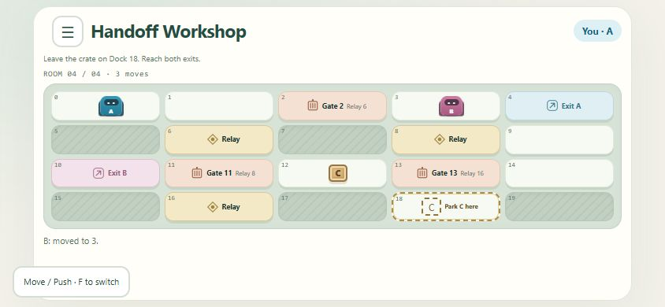

# Signal Foundry

A cooperative browser puzzle game for two players. Guide two robots through a small factory, power your partner's gates, move a crate and escape together.

Current source version: **1.1.0**, with four playable rooms and improved crate guidance, relay labels and safe gate-departure feedback. Player-reported playtesting informed these changes. No 1.1.0 Docker image has been built or published; the existing 1.0.0 image remains separate from current source. See the [changelog](CHANGELOG.md).



## Play

Create a room and share its six-character code. Your partner joins from another device or independent browser profile. Play starts when both players connect; no player account or installation is required.

- Move with arrow keys, WASD or adjacent tile taps. Each robot moves independently; staying still holds its relay.
- Walk into the crate to push. Press **F** or use the visible mode control to toggle Pull, then step away with the crate directly behind you. Switch back to Move for ordinary movement.
- Reach both robot exits together. Crate rooms also require parking the crate on the marked dock.
- Open **Menu** for controls, lessons, restart, levels and Leave room. Restart and level changes require partner consent; leaving does not.
- Completed rooms receive green marks, remembered in the current browser rather than a cloud account.

| Room | Cooperation challenge |
| --- | --- |
| First Connection | Power your partner's route through latching gates |
| Trade Places | Share passages and hold a pressure relay |
| Keep the Power On | Park a crate on Relay 8 to maintain power |
| Handoff Workshop | Exchange support roles, turn the crate onto Dock 18 and rescue the support robot |

Two tabs in one browser profile share a session. For two independent players on one computer, use normal/private windows or separate profiles.

## Local development

Pinned toolchain: Node.js **24.19.0**, pnpm **11.19.0**. Dependencies are locked in `game/pnpm-lock.yaml`.

```sh
cd game
pnpm --ignore-workspace install --frozen-lockfile
pnpm --ignore-workspace test
pnpm --ignore-workspace start
```

Open [http://127.0.0.1:3000](http://127.0.0.1:3000). Tests compile before running; use `pnpm --ignore-workspace build` to compile separately. The loopback development URL is not reachable from another device. Public hosting requires HTTPS/WSS and an exact `APP_ORIGIN`.

## Container release and Azure

No container build is part of the 1.1.0 source checkpoint. For a future explicitly requested image build, run from the repository root:

```sh
docker build --platform linux/amd64 --build-arg VCS_REF=<commit-sha> -t signal-foundry:1.1.0 .
```

The multi-stage build runs the regression suite. The non-root runtime contains compiled code, production dependencies and public assets, excluding research, tests, contest reference documents and credentials.

Version 1.0.0 was published successfully through [GitHub Actions](https://github.com/LucasLee1234/Multi-Player-Game-with-AI/actions/runs/37839259092). Anonymous registry access was verified. Pull it with:

```sh
docker pull ghcr.io/lucaslee1234/signal-foundry:1.0.0
```

For an immutable deployment, use `ghcr.io/lucaslee1234/signal-foundry@sha256:f264ddb687286eabcdefe39772698112a31ab8d6e424447d8d3888565dac4ee5`. [Release evidence](releases/v1.0.0.json) records the source commit, local archive checksum and published digest. Git tag `v1.0.0` also produces image tags `v1` and a commit-specific tag.

Azure Container Apps requires HTTPS HTTP ingress, target port 3000, `APP_ORIGIN=https://<assigned-hostname>`, one application worker, one serving revision and minimum/maximum replicas both set to 1. Configure `/health/live` and `/health/ready` probes. [Container instructions and release checklist](docs/azure-container-v1.md).

## State and limits

Rooms and sessions live in one Node.js process. Multiple independent rooms are supported, but **restarting or replacing the process ends existing rooms**. There is no server database, cloud progress synchronization or horizontal scaling support.

Defaults: 20 rooms, 500 sessions, a 60-second disconnect recovery window and a two-hour maximum room lifetime. These are lifecycle/admission bounds, not measured production capacity. Reconnection needs the same server to retain the room.

## Verification

The application passed **79 automated tests**, including HTTP/WebSocket flows, authorization, duplicate/stale commands, room isolation, restart, consent-bound levels, crate previews and safe gate departure. Actual-engine searches found all reachable spatial states recoverable in all four rooms; Handoff Workshop has 2,000 configurations and a shortest 26-step completion.

Browser A with a developer scripted partner completed room four and checked F/Pull, parking, replay, green marks and exit. Responsive inspection covered 390x844 and 844x390 without page overflow. These checks do not establish independent two-human enjoyment, actual-phone behavior or public deployment readiness. [Fourth-room evidence](docs/handoff-workshop-implementation.md), [earlier test evidence](docs/test-evidence.md).

`game/tests/manual-partner.mjs` is a development-only helper, not served, automatically started or offered as a public game mode. Historical J1 and Python research variants have different rules and are not the default game.

## Next room design

[Freight Exchange](docs/freight-exchange-design.md) proposes recovering the crate from a lower bay to Dock 6. An actual-engine audit found a 30-step solution, all 2,000 reachable configurations recoverable, and both robots necessarily transporting the crate. This is a validated design proposal; it is not installed in the four-room campaign.

## Repository

```text
game/src/       Server, rules, authored rooms, client and contracts
game/public/    Public HTML and CSS
game/tests/     Rule, lifecycle and HTTP/WebSocket tests
game/scripts/   Build/test entry point
game/research/  Historical experiments and actual-engine audits
docs/           Requirements, design, planning and validation evidence
Dockerfile      Regression gate and runtime image
.github/        Tagged container release workflow
```

Supplied contest references remain local and are excluded from Git and Docker. Some historical planning links reference those unavailable files; public official sources are also linked in planning documents.

## Development and context

[Requirements](docs/requirements-analysis.md) · [Architecture](docs/architecture.md) · [Short coding cycle](docs/short-development-cycle.md) · [Tasks](docs/tasks.md) · [Competition plan](docs/competition-plan.md)

Built with AI assistance during design and development. Gameplay does not call an AI service at runtime. Prepared for the Handshake AI Skills Studio x OpenAI multiplayer game challenge; submission and award outcomes are not claimed.

## License

Original code and authored documentation use the [MIT License](LICENSE), copyright 2026 HongBo Li. Dependencies retain their own licenses; see [third-party notices](THIRD_PARTY_NOTICES.md). Contest materials and external trademarks are not relicensed by this repository.
