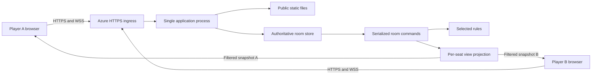

# Signal Rescue - System Architecture

Version: 0.1
Date: October 6, 2026
Status: SYS-01 lobby and SYS-02 J1-C1 asymmetric gameplay implemented locally. See [test-evidence.md](test-evidence.md) for tested scope and remaining contracts. Public deployment, teaching content, human validation, and release acceptance remain incomplete.

SF-T1 update: the authorized First Connection experiment is now implemented as the default startup profile (`sys-03-sf-t1`). It reuses the room/authority lifecycle and adds public relay/gate views. The profile delta below takes precedence over earlier J1-specific next-step statements. Public hosting, actual phone/human validation, and release acceptance remain open.
Inputs: [SRS 1.1](requirements-analysis.md), [readiness review](requirements-readiness-review.md), [audited 0.2 rules](game-design.md), [J1 analysis](gameplay-cooperation-analysis.md), and [short development cycle](short-development-cycle.md).

## 1. Design outcome and boundary

Use one authoritative application serving both the browser files and a small room/game service. Each room owns one pair of players and a versioned mission. Browser clients send intentions; the server validates, resolves, and sends separate filtered views. No browser determines the true hazard result, final positions, score, or partner authorization.

Select a simple single-process design for the first release. Keep room state in memory and explicitly terminate lost sessions after a process restart. Do not add a database, multiple services, player accounts, or a generic engine supporting every researched variant. This is a deliberate recovery tradeoff, not a claim of restart resilience.

The two-player scope and privacy/consistency requirements are backed project needs. Technical choices and numerical defaults below are proposed design decisions, to verify during implementation and public proof. Azure resource creation, cash spending, GitHub publication, and prototype construction are not performed by this document.

## 2. Context and deployment shape



Development uses the same application contract on loopback. The proposed public host is Azure Container Apps with one active serving revision, one application worker, and one replica. During revision replacement there may be overlapping processes; use the maintenance/reset procedure in Section 12 rather than assuming an uninterrupted shared store.

Microsoft documents HTTPS and WebSocket ingress support and replica scaling controls. Those establish a viable candidate, not student-subscription access, suitability of a specific region, or an affordable quote. [S1-S2]

## 3. Technology decisions

| Decision | Selected design direction | Reason and limitation |
| --- | --- | --- |
| Runtime | Node.js 24 LTS, exact patch pinned at implementation | Supported LTS line in the checked release table; local `node --version` returned 24.20.0. Do not adopt the Current line merely because it is newer. [S4] |
| Language | TypeScript for server and browser, compiled during build | Explicit command/view types support boundary review; runtime validation is still required |
| UI | HTML/CSS and a small DOM-based TypeScript client | Nine-cell research boards and a few screens do not require a UI framework; exact gameplay size remains a candidate |
| HTTP | Node HTTP routing for a small fixed route set | Same-origin assets and admission; no framework selected until a concrete need appears |
| Live channel | Browser WebSocket and the server `ws` library | Small bidirectional updates; browser uses its native implementation, not the Node package. [S5] |
| Testing | Node's test runner for compiled rule/server code and real browser checks | Use a standard runner and meaningful boundary/integration cases. [S6] |
| Hosting | Evaluate Azure Container Apps first | Same app hosts static files and live backend; account and priced configuration pending |
| State | In-memory rooms in one process | Simple ownership; intentional loss on restart and no horizontal scaling |
| Dependency policy | Pin runtime/dependency versions and commit a lockfile | Exact versions selected and tested at implementation, not invented here |

A polling transport or another Azure service is a fallback to evaluate only if a reproduced platform/access issue blocks the proposed route. Do not maintain multiple transports or hosting paths simultaneously.

Environment inspection found a functioning Node executable but a broken default npm launcher referencing a missing `npm-cli.js`. The bundled dependency runtime also supplies Node and pnpm paths. Establish one functioning package-manager path and record it before installing or building; do not claim the npm problem has been fixed. Azure CLI was not found by the command lookup. Neither issue blocks this design document.

## 4. Modules and requirement ownership

Module layout: server/contracts/client/public/tests and J1 rules/server-only content now exist; deploy remains future work:

```text
game/
  src/
    server/       HTTP, WebSocket, session authorization, room ownership
    rules/        Pure selected-version action resolution
    content/      Server-only authored mission definitions
    contracts/    Public protocol and view types, no hidden mission content
    client/       Views, controls, connection handling
  public/         Public HTML/CSS and future display assets
  tests/          Rule, authorization, protocol, lifecycle, content checks
  research/       Existing historical Python analysis
  deploy/         Container and Azure configuration when selected
docs/             Design and evidence
```

| Module | Responsibility | Main requirements |
| --- | --- | --- |
| Admission/session | Create/join, seat capability, origin checks, active session lookup | FR-01 to FR-06, FR-19; NFR-02, NFR-16 |
| Room owner | Lifecycle, seat connections, serialized mutation, reset/expiry | FR-04, FR-16 to FR-20, FR-24; NFR-01, NFR-03, NFR-15 |
| Command processor | Validate identity/state/sequence; deduplicate; agree and resolve once | FR-09 to FR-12, FR-17; NFR-01, NFR-14 |
| Rule functions | Selected move/hazard/collision/end/result behavior | FR-07, FR-09, FR-12 to FR-15; SR-04 |
| View projection | Construct allowed public/own-known/partner-hazard data | FR-06, FR-08, FR-10, FR-13; NFR-02 |
| Content validation | Version missions and check safe routes and information traces | FR-22, FR-23; NFR-14 |
| Browser client | Join, guidance, plan, agreement, outcomes, recovery, onboarding | FR-01 to FR-03, FR-07 to FR-11, FR-13 to FR-21, FR-24; NFR-04 to NFR-06, NFR-12 |
| Runtime/deployment | Secure public ingress, bounded resources, diagnostics, release/reset | NFR-07 to NFR-11, NFR-13, NFR-15, NFR-16; DR-02 to DR-05 |

Serve only an explicitly public output directory. Server content, test fixtures, route solutions, research files, documents, and source maps containing private content must not be reachable through static-file routing. A public source repository can still reveal authored maps to a determined reader; this game is not designed to prevent memorization or source-assisted play.

## 5. State ownership and identities

| Entity | Owned state |
| --- | --- |
| Server process | Random `bootId`, room/session indexes, limits, monotonic expiry deadlines, release ID |
| Browser session | Server-generated capability hash, context version, current room/seat association, bounded admission deduplication records |
| Room | Internal random ID, unique join code, lifecycle phase, revision, seats, setup owner, mission, timestamps, pause/expiry state |
| Seat | A/B role, owning browser session, connection epoch, active channel, ready/start/next choices, next command sequence, bounded acknowledgement cache |
| Mission | Mission ID, selected rule version, server-only content, positions, both hazards, learned cells, accepted signals, turn/strikes/result |

Use a random internal room ID independent of its code. Generate six-character codes from an unambiguous 32-character alphabet with a cryptographic random source; check uniqueness against live codes and retained closed-room records. Codes locate a room; they never authorize control of an occupied seat.

`roomVersion` increases on observable state changes, including connections and readiness. `planningRevision` increases only when relevant proposals or information change, not when a player confirms. `missionId` changes on every start/retry/continue, even for the same layout. `lobbyRevision` changes when waiting-seat membership/availability invalidates start agreement. A client's old `roomVersion` alone does not invalidate a current Ready request, because the partner's Ready legitimately changes it.

One browser session controls at most one live room seat. Different devices or a normal/private browser context create independent sessions. Do not infer that two tabs in the same cookie context are two players.

## 6. Session control and private views

### Anonymous control, without player accounts

Bootstrap an anonymous session before room creation/join. Set a cryptographically random 256-bit capability in a production `Secure`, `HttpOnly`, `SameSite=Strict`, host-only cookie with `Path=/`; store only its hash server-side. No email, password, login, or player profile is involved. Cookie possession authorizes that session's seat, not an arbitrary claimed seat in a message.

All state-changing HTTP requests require the configured same origin, JSON bodies, input validation, and the correct session context. WebSocket upgrades require the same allowed Origin and capability cookie. Reject cross-origin upgrades/commands; do not enable wildcard CORS. Recovery credentials never go in room links, query strings, browser-readable storage, or logs. Room codes may be copied as public joining information.

Refresh the cookie expiry at accepted room admission to align with that room's maximum lifetime. Pin the associated server session record until its room closes rather than deleting it at an earlier anonymous-session deadline. Unassociated records expire after two hours; pinning is bounded by the fixed room lifetime. Do not silently evict an active seat to admit another session.

The browser's active socket owns its seat for commands. A second tab receives `CONTROLLER_ACTIVE` without displacing the first. An explicit "Use this tab" takeover replaces the controller, increments the connection epoch, clears relevant agreements, and fences old-channel commands. Reconnecting after the old channel is declared disconnected needs no takeover. A copied capability remains a bearer secret; this design prevents casual code-based seat theft, not theft by a fully compromised browser.

Loopback development may use a distinct non-Secure development cookie over local HTTP. Public and LAN play require HTTPS/WSS. Production startup rejects an insecure public-mode configuration.

### Per-seat snapshot contract

Build a new allowlisted object for each recipient; never serialize a Room/Mission object and remove a few fields afterward.

```text
protocolVersion, releaseId, bootId
room: id, code, phase, roomVersion, partnerConnected
self: role, controllerEpoch, nextCommandSequence
mission: id, ruleVersion, public geometry, positions, exits,
         turn, strikes, proposed destinations, planningRevision,
         public readiness/signals, result when allowed
ownKnownCells: only allowed known safety information for this role
partnerHazards: the authorized partner layer
timers: displayable expiry/recovery remaining, when relevant
```

Waiting snapshots have no mission maps. The browser never receives unrevealed own hazards, partner credentials, command history containing secrets, internal solver solutions, or raw server state. Learned information follows the selected rule contract; recovery restores only that seat's filtered state.

Send full filtered snapshots on accepted mutations and reconnect. The state is small enough that delta encoding would add needless complexity. A client renders the highest valid version for its current boot/room/mission, uses intents only for pending controls, and never predicts authoritative positions or hazard results.

## 7. HTTP and WebSocket contracts

| Interface | Purpose and restrictions |
| --- | --- |
| `GET /` and allowlisted assets | Public UI; no server content or diagnostic secrets |
| `POST /api/session` | Bootstrap/lookup anonymous cookie session; repeated use must not allocate unbounded records |
| `GET /api/session` | Current context and authorized room view, or explicit unavailable/ended state; private response is not cached |
| `POST /api/rooms` | Create under current context; assign A and setup-owner role |
| `POST /api/rooms/join` | Join an available waiting seat under current context; active missions have no anonymous replacement |
| `GET /ws` upgrade | Authorize the associated seat and establish one active controller; transmit commands, acknowledgements, filtered snapshots |
| `POST /api/controller/takeover` | Explicit controller transfer; origin/session/context checked and old epoch fenced |
| `GET /health/live`, `GET /health/ready` | Minimal process/admission health; never list rooms or capabilities |

HTTP create/join/takeover carry `requestId`, `expectedContextVersion`, and a validated action payload. Bound their acknowledgement cache. Deduplicate before checking the now-changed context. If an old record is evicted, its stale context fails rather than creating another room. Bootstrap itself does not create a room, so lost bootstrap responses do not duplicate rooms. Admission and session-context mutation must be serialized as well as gameplay.

Game command envelope:

```text
type = command
requestId = bounded random identifier
sequence = next positive seat sequence
roomId, controllerEpoch
missionId, turn, planningRevision = required for gameplay
action = startAgreement | propose | signal | ready | nextChoice | leave
payload = action-specific validated fields
```

Seat identity is inferred from the authorized channel. The server ignores/rejects submitted role, hazard label, strike total, score, result, or final position fields. `startAgreement` references `lobbyRevision`; `nextChoice` references the terminal `missionId` instead of a planning revision.

Proposed actions are fixed, not a generic server-execution interface. `signal` supplies only the cell; the selected rules compute its label. `nextChoice` is Retry or Continue when available. `sync` is a read-only request for a new filtered snapshot, not a turn mutation.

Errors: `INVALID_INPUT`, `ROOM_UNAVAILABLE`, `ROOM_FULL`, `ROOM_CLOSED`, `NOT_AUTHORIZED`, `CONTROLLER_ACTIVE`, `CONTROLLER_REPLACED`, `STALE_CONTEXT`, `STALE_MISSION`, `STALE_PLAN`, `OUT_OF_ORDER`, `REQUEST_TOO_OLD`, `REQUEST_CONFLICT`, `SIGNAL_UNAVAILABLE`, `PAUSED`, `RATE_LIMITED`, and `SERVER_BUSY`. Errors reveal only permitted context. Private acknowledgements are sent only to the issuing seat, while resulting filtered snapshots go to both.

## 8. Atomic processing and agreement

1. Check frame size, schema, origin-established channel, capability/seat/controller epoch, and admission/rate bounds.
2. Enter that room's serialized command path. No external I/O or asynchronous yield is allowed inside the state validation/mutation critical section.
3. Check request ID, sequence, and canonical payload hash. A cached identical command returns its original acknowledgement plus current allowed view. Reusing an ID/sequence with different contents fails.
4. A sequence below the next expected value with no cached record fails `REQUEST_TOO_OLD`; a larger sequence fails `OUT_OF_ORDER`. Neither is applied. For a valid next envelope, domain validation failures also receive a cached result and consume that sequence, so retry behavior is explicit.
5. Validate phase, mission/turn, and the relevant planning/lobby revision. Apply a valid action or record its rejection without changing gameplay.
6. On a changed proposal or accepted new clue, clear both ready flags and advance the planning revision. Ready itself does not advance it. A repeated unchanged proposal is a no-op.
7. The second current valid Ready closes planning and applies exactly one pure rule transition. Advance mission turn or enter terminal state, then increment room version and project views.
8. Persist bounded acknowledgement metadata in memory before sending. Broadcast filtered snapshots. If delivery fails, recovery sees the committed result; no rollback based on a missing acknowledgement.

A client keeps one command in flight and retries an uncertain acknowledgement with the same envelope. It obtains `nextCommandSequence` on reconnect rather than guessing. Keep the most recent 128 acknowledgements per seat; monotonic sequence and context/revision guards make evicted retries reject safely. Hash comparison alone is not a substitute for sequence/version guards.

Disconnect, expiry, and takeover events use the same serialization discipline. If a turn resolves before disconnect is detected, that valid result remains committed; if pause is processed first, readiness is cleared and resolution cannot proceed. Network loss cannot be detected instantaneously. Never promise that an already committed turn disappears because a client subsequently reports a lost connection.

## 9. Room lifecycle and post-mission agreement

Technical defaults below are selected for the proposed contract; they remain configurable and untested. The setup owner is a sharing/setup role, not a more powerful gameplay controller.

| State / event | Result |
| --- | --- |
| Create | Waiting room with A; valid B may join |
| Waiting, second player joins | Preserve roles; bump lobby revision, clear start agreement |
| Waiting, both connected and agree on current lobby | Initialize a versioned mission; Planning |
| Waiting, explicit leave | Vacate that seat and invalidate its capability association; transfer setup-owner role to remaining player if needed; replacement allowed only here |
| Waiting, all players explicitly leave | Close room |
| Any occupied phase, transient disconnect | Reserve both seats; save prior phase and set Paused; clear start/turn/post-mission agreement; no new anonymous player may replace a reserved seat |
| Paused, both return before deadline | Restore prior phase and current mission knowledge; require fresh agreement, never restore Ready flags |
| Paused, deadline expires | Close room and abort an active mission without score; preserve a terminal result only in the ended-session message if it was already committed |
| Planning, second current Ready | Resolving and one atomic rule transition, then Planning or Terminal |
| Terminal, mismatched Retry/Continue | Keep both choices visible and pending; either may revise; no transition yet |
| Terminal, matching valid choices and both connected | Exactly one new mission; new ID, reset required mission state; seat sequences continue |
| Active/Paused/Terminal, explicit leave | End room for both; no mid-mission replacement or host migration |
| Room idle/hard lifetime expires | Close with an explicit expiry message; no forced move |
| Process restart loses store | Old session cannot be restored; UI shows session ended and offers new create/join |

Recovery grace is 60 seconds from the first detected disconnect of the pause episode. Save the pre-pause phase only when entering Paused; another disconnect while paused does not overwrite it with Paused. Repeated disconnect events do not extend the deadline. Reconnect strictly before the deadline resumes; at or after it closes. On successful resume, clear the episode deadline. A later new loss is a new episode, while hard room lifetime remains fixed.

Waiting idle expiry: 10 minutes. Active/terminal interaction idle expiry: 30 minutes. Hard room lifetime: two hours from creation. Heartbeats do not reset interaction idle time; genuine accepted player interactions do. These limits bound abandoned rooms, not turn pressure. Display approaching expiry and allow a meaningful accepted interaction to extend idle time within the hard bound. Terminal result recovery follows the same pause grace; closing never rewrites a committed result into a played failure.

A page refresh is transient loss, not explicit Leave. A duplicate tab is controller contention, not a new player. An explicit waiting-seat leave allows replacement; temporary loss reserves the seat until recovery/closure. If A is replaced in Waiting, the new owner of A does not inherit any old mission knowledge because no mission is active.

## 10. Gameplay candidate boundary

Recommend J1 as the first gameplay candidate, but do not adopt it as the final production baseline here. The framework owns lifecycle/auth/views/commands; a small pure rule module owns one selected rule contract, not interchangeable runtime modes.

The next-engine test specification is [J1-C1](candidate-gameplay-spec.md), covering geometry, hazards, signals, joint exit, resolution, provisional bounds, unscored results, and asymmetric paper witnesses. The [static layout](mobile-wireframe.html) supplies interface preparation. These artifacts do not validate an implemented engine or imply all old maps transfer.

J1 remains: both robots stay active, and win requires simultaneous occupation of their respective exits after hazard/collision handling. 0.2 removes robots at exit. Do not mix the sentinel, occupancy, UI wording, or test expectations of those versions. An eight-turn/three-strike/two-hazard candidate is not an established balance requirement.

The rule module returns public resolution explanations, updated authoritative mission state, and permitted knowledge changes. It never sends network messages or accepts an unauthenticated role. Level definitions/solutions are server-only. Final authored mission counts and human enjoyment remain open.

## 11. Proposed operating envelope and measurement

| Setting | Initial design default | Verification obligation |
| --- | --- | --- |
| Live rooms | 20 maximum, including waiting/paused rooms | Admission at the limit, cleanup, synthetic isolation/load; not an advertised tested capacity |
| Anonymous session records | 500 maximum with two-hour expiry and pruning | Bounded rejected bootstrap/admission; active associations not evicted silently |
| Occupied player sockets | At most two controllers per room | Duplicate-controller rejection and explicit takeover fencing |
| Admission attempts | Per-session 5 create/join attempts/minute; global 60/minute | Controlled feedback; document any trusted-IP limiter separately rather than trusting arbitrary forwarded headers |
| Gameplay commands | 10/second per seat, burst 20 | Normal edits work; abusive streams cannot allocate unbounded work |
| Input body/frame | 8 KiB maximum; bounded fields and board coordinates | Reject oversized/unknown fields before domain mutation |
| Queued work | 32 commands maximum per room; reject excess before enqueue | Fair processing and recovery without unbounded queue growth |
| Outgoing socket buffer | 256 KiB maximum before closing a slow channel | Heartbeat/pause/reconnect contract applies; do not queue indefinite snapshots |
| Heartbeat | Probe every 15 seconds; declare unhealthy after 30 seconds without liveness | Browser suspension/network loss behavior on actual target devices |
| Cleanup | Sweep at most every 15 seconds; every request also checks deadlines | No command or join acts on logically expired state even before the sweep |
| Closed-room metadata | 10 minutes, bounded to 200 records | Generic ended-state feedback without retaining hazard maps/capabilities |
| Acknowledgements | 128 per seat and bounded admission records per session | Evicted duplicate rejection, payload conflict, reconnect sequencing |

All resource structures, including rate counters, need bounded storage/expiry. Limits are application protection defaults, not a cloud bill cap or a security guarantee. Check serialized snapshot size and actual memory before changing limits. MDN documents that the browser WebSocket interface has no automatic backpressure, which supports explicit buffering bounds. [S3]

### Compatibility and latency evidence

Initial compatibility target is the owner's actual phone/browser and computer/browser; record exact versions before making claims. Use 360 CSS-pixel and 1280 CSS-pixel viewport layouts as proposed development checks, not complete device coverage. No obsolete-browser polyfill framework is included.

For live update latency, issue at least 30 paired probes on the actual deployment/networks. A receives a monotonic-clock probe start, server forwards it through B, and B acknowledges after applying the version and passing a paint opportunity. A measures round trip on its own clock. Report median, high percentile, maximum, and both directional runs. This round-trip observation is a conservative end-to-end proxy, not an independently measured one-way latency or proof of physical screen paint.

If at least 95% of these round trips meet the proposed 1.5-second target, report that conservative check passed. If not, measure separate server/transport/client delays before claiming the SRS one-way target failed. Record configuration, sampling method, probe behavior, and clock limits. Never subtract uncalibrated timestamps from two devices. No performance result exists yet.

### Diagnostics

Record release/boot ID, counts, connection lifecycle, error categories, processing duration, and coarse latency samples. Avoid raw capability cookies, private maps, full command bodies, and personal documents in logs. Set finite log retention and estimate its cost. Provide minimal health signals, not a room-inspection dashboard or an unprotected debug endpoint. Operators can diagnose state loss through boot/release IDs and controlled counters.

## 12. Azure hosting, cost, and release procedure

Prefer one Container Apps application with HTTPS external ingress, a single active serving revision, one Node worker, and `minReplicas=1`, `maxReplicas=1` as the candidate configuration. This avoids scale-to-zero and ordinary multi-replica split ownership at the cost of keeping a replica provisioned. The billing effect, CPU/memory size, region, permissions, logs, registry/image delivery, and credit expiry must be checked before provisioning. Microsoft describes usage-based compute and request charges; free allowances do not establish the cost of this configuration. [S1-S2, S7]

A single replica can restart or be replaced. Per-client session affinity is not coordination between two different room members. Do not change replica/worker counts or split traffic across app revisions while using this in-memory design. Supporting multiple replicas requires a new ownership/shared-state design, not a config-only change.

Azure App Service is a fallback candidate only if Container Apps access or priced runway is unsuitable. Its tier, WebSocket behavior, region, and cost would need a fresh check. No resource, database, registry, subscription upgrade, or paid DNS name is selected/provisioned here.

Proposed release steps:

1. Build/test from the intended Git checkpoint with pinned dependencies; package only runtime/public outputs and server content.
2. Save image/build ID, rule/content versions, configuration, and test evidence. Keep the previous release artifact.
3. Enter an operator-controlled maintenance window: deny new room admission, inform connected players, allow bounded completion or explicitly end remaining rooms. Close old live channels before routing to the replacement process.
4. Switch public traffic to one new serving revision without weighted multi-revision play. Existing in-memory sessions are not migrated.
5. Check health, signed-out access, create/join, filtered views, a two-device session, and observed usage. On failure restore the known-good artifact with the same safe room reset procedure.
6. Record actual public URL, release ID, source commit, configuration, and remote sync status in README/evidence.

The candidate must remain within verified credit through the review window. Price compute, ingress requests, image storage/delivery, logs, networking, and any related resources; use real subscription data. Lower idle cost options are alternatives to compare, not silent changes that discard live rooms. Budget alerts and application admission limits do not enforce a hard monetary spending cap.

## 13. First implementation slice

Identifier: SYS-01 / Room and Authorized Connection. Coding subsequently resumed by explicit participant instruction; this local slice is implemented. The design acceptance list below is retained; actual tested scope and limits are in [test-evidence.md](test-evidence.md).

Outcome: two independent browser sessions can create/join one room, obtain A/B roles, see shared connection/setup state, and receive only their authorized snapshot. This slice has no actual mission, hazard navigation, score, final art, or Azure provisioning. Server-private synthetic fixtures may test projection without pretending to implement gameplay.

The SYS-01 UI explicitly labels gameplay as not yet implemented and does not expose an enabled mission Start action. Full mutual-start-to-mission transition belongs to the next selected-rule slice. Lobby connection/readiness checks are not reported as a completed game.

Prerequisites: functioning package manager; project-local Git/identity; low-fidelity create/join/waiting layout; implementable contract from Sections 5-9. GitHub URL is not required for local progress but remains required before claiming remote synchronization.

Acceptance checks:

- Create/join in normal/private contexts; same room identity and different roles; one player cannot start.
- Simultaneous admissions produce exactly two seats; third-player/invalid/expired room cases fail clearly.
- Knowing a code cannot read private fixture values or control either occupied seat.
- Duplicate create/join requests do not allocate another room/seat, including a lost acknowledgement.
- Duplicate tab is not a third player; takeover fences old commands.
- Connection loss reserves the seat; authorized recovery refreshes state; wrong-seat/expired recovery fails.
- Explicit waiting leave and setup-owner transfer follow the lifecycle; old capabilities do not control replacements.
- Cross-room commands, invalid origins, oversized frames, stale contexts, and limits are handled consistently.
- Process restart gives a clear ended-session flow. Tests use injectable clock/deadlines rather than long sleeps.

Use automated tests for authority, projection, sequencing, and lifecycle; browser inspection for cookies, controls, and feedback. Real public different-device/network proof follows with verified Azure access. Local two tabs are development evidence only.

The next slice adds one synchronized turn after a candidate rule contract is selected. Do not build a generic application shell and postpone all privacy/authority checks until the end.

## 14. Decisions, unresolved dependencies, and readiness

SYS-02 contract update: actual messages use startAgreement with lobbyRevision, propose/signal/ready with missionId/turn/planningRevision, and retryAgreement with terminal missionId. There is one implemented mission and no Continue action yet. Valid next-sequence domain errors are acknowledged/cached and consume sequence; malformed/authorization/sequence failures do not. Controller epoch fences the channel, while the cached semantic hash excludes epoch so authorized reconnect can retry the same request ID/sequence/intent. It never reinterprets that retry as a new action. The browser keeps one command in flight until acknowledgement and subsequent authoritative snapshot, retaining failed/stale-plan feedback. Source contracts and executed tests are authoritative for this implemented subset.

Pause preserves the prior waiting/planning/terminal phase and mission, clears turn/start/retry agreements, and does not extend the first recovery deadline. Retry creates a new mission ID and resets game knowledge/state while preserving seat sequence. Ended-session metadata retains a committed terminal outcome without private maps. Existing room/input/heartbeat limits apply; active/terminal idle expiry is 30 minutes, waiting is 10, with the same two-hour hard lifetime. Numeric limits still do not establish tested production capacity.


| SRS open item | Design disposition |
| --- | --- |
| O-01 to O-05 | J1-C1 now specifies a bounded candidate and asymmetric paper witnesses; executable, human, and release acceptance remain open |
| O-06 | Proposed matching, revisable post-mission choices and two-player start agreement defined in Section 9 |
| O-07 / O-12 | Proposed technical lifecycle, deadlines, explicit leave, refresh, duplicate controller, replacement, and lost-state policies defined |
| O-08 | Azure access/balance/pricing unresolved; Container Apps first candidate only |
| O-09 / O-13 | Draft bounded envelope, compatibility target, and conservative latency method selected; actual devices/capacity/cost remain unverified |
| O-10 | Project-local repository and dependencies established in SYS-01; GitHub still absent |
| O-11 | Contest/account/tool obligations unchanged; architecture does not determine entrant eligibility |

Architecture responsibilities and first-slice contracts are reviewable. Full gameplay design is not ready to freeze until one selected rule version and asymmetric mission trace are completed. G2 and G3 remain open. No implementation, unit/integration test, device test, cloud deployment, Git commit/push, or human feedback is claimed by this design step.

## 15. Implemented SF-T1 profile delta

Current v3 override: default startup uses `firstConnectionFree` and release `sys-04-free-move`. `Store.connect` starts the mission once both seats have live channels. New `move` envelopes have missionId/from/destination; new `ping` envelopes have missionId/cell. They retain seat sequence/request/epoch/room authentication and omit shared turn/planning revision so partner actions cannot invalidate independent moves. Wrong own origin rejects as STALE_POSITION. Commands resolve synchronously in arrival order, derive live gate power, and broadcast authoritative state. Idle has no movement tick. Legacy confirmation commands reject for this profile. Browser directions/arrow keys/WASD send one step and wait only for their own acknowledgement/snapshot; per-move Ready/Wait/start controls are hidden. Latest pings persist and are replaceable. Pause/reconnect and mutual terminal retry remain. Exact behavior/evidence: [independent-movement-spec.md](independent-movement-spec.md). The v2 explanation below is retained as historical context.

The startup entry point selects a fixed mission definition for the process: default `GAME_MODE=foundry`, optional developer comparison `GAME_MODE=J1`. Unsupported values fail startup. `Store` accepts a server-controlled mission definition; clients cannot select or inject one. Room start and mutual retry use the same configured definition. The application factory keeps its former J1 default for existing tests; startup explicitly provides the selected store.

The rule module branches on the server-owned foundry definition. SF-T1 uses a 4-by-3 board, walkable/wall geometry, turn-start relay power, latch-on-entry gates, and joint exits at 3/11 without strikes or a turn limit. Latches belong to the mission and survive pause/reconnect, clear only on a new attempt, and never come from client input.

`MissionView.ruleVersion` includes `SF-T1-v2`; the optional `foundry` field contains width, height, walls, and gates with cell/relay/powered/latched/open state. This teaching map is public; own knowledge and partner hazards are empty arrays. The explicit projection still omits internal mission definitions and authorization state. J1 snapshots do not receive a foundry field.

For SF-T1, the existing `signal` envelope means a bounded public tile ping. Only walkable cell IDs are valid. One accepted ping per player per turn clears both confirmations. The legacy `safety: Safe` field describes walkability only and must not be treated as an open gate. The client shows the location ping and matching relay/gate links; there is no runtime AI or free-text messaging.

All commands retain mission/turn/revision, per-seat sequence and epoch checks. The single-threaded second-Ready transition commits actual movement and latches before broadcasting. Existing pause clears readiness while preserving the mission; retry starts a fresh ID and clears all latches. Results use only success/turn count in the foundry UI. Historical J1 outcomes still use strike/turn failure metadata.

Verification: 46 tests pass, including all J1/room regressions, foundry exhaustive state exploration, actual two-context wire completion/reset, and room recovery retaining latches. Narrow-layout inspection is emulated, not an actual phone proof. See [test-evidence.md](test-evidence.md).

## Sources

Official product/library documentation checked October 6, 2026. These support technical capabilities and limitations, not the participant's account state or an independent design certification.

- **S1:** [Azure Container Apps ingress](https://learn.microsoft.com/en-us/azure/container-apps/ingress-overview).
- **S2:** [Azure Container Apps scaling](https://learn.microsoft.com/en-us/azure/container-apps/scale-app).
- **S3:** [MDN WebSocket interface](https://developer.mozilla.org/en-US/docs/Web/API/WebSocket).
- **S4:** [Node.js release lifecycle](https://nodejs.org/en/about/previous-releases).
- **S5:** [ws maintained repository and usage documentation](https://github.com/websockets/ws).
- **S6:** [Node.js test runner](https://nodejs.org/api/test.html).
- **S7:** [Azure Container Apps billing](https://learn.microsoft.com/en-us/azure/container-apps/billing).

## 16. SF-02 authored factories and progression

October 7, 2026: startup uses `foundryAdventure` and release `sys-05-shared-passage`. Server-owned factory definitions supply dimensions, walls, starts/exits, gate kinds/links and a hint. Projection allowlists these public fields and only the next title, never the nested server definition. The client regenerates tiles on mission ID changes and renders declared columns; hover updates text/classes without rebuilding clicked tiles.

Ordered independent steps use current positions/power. Latching entry persists; pressure gates never latch and restrict entry only. Successful steps alone count. Terminal `nextAgreement` and `retryAgreement` bind to a mission ID and set revisable per-seat choices. Matching choices transition once; mismatch waits. Next requires success and an authored successor; Retry uses the current definition. Pause clears choices; cached replay acknowledges without restoring consent. Sequences/controller epochs/deduplication continue across new mission IDs. [SF-02 contract](shared-passage-implementation.md) is authoritative. SF-M3 was subsequently implemented on October 8; see section 17.

## 17. SF-03 crate state and ordered transport

October 8, 2026: default startup release is sys-06-crate, with three nested authored room definitions. Factory definitions optionally declare crate start/target; authoritative missions own its current cell. Projection exposes only current/target cells, never client-editable authority. crateMove extends the existing envelope with missionId, from, crateFrom, destination and kind (move or pull). Strict schema validation accepts the enum and rejects injected fields. Mission, controller, sequence and acknowledgement guards continue across room transitions.

A single ordered request validates geometry, own/crate freshness, partner occupancy and live gate entry before committing robot and cargo together. Crates and robots power relays; latching entry persists, pressure power is recomputed. Closed occupants may leave, but a pulled crate entering the vacated gate needs current power. No shared planning revision, timer tick or simultaneous crate cancellation is introduced. Terminal success requires both exits and crate on the target; retry reinitializes current authored room. See [crate implementation](crate-implementation.md) for verified boundaries and evidence.
