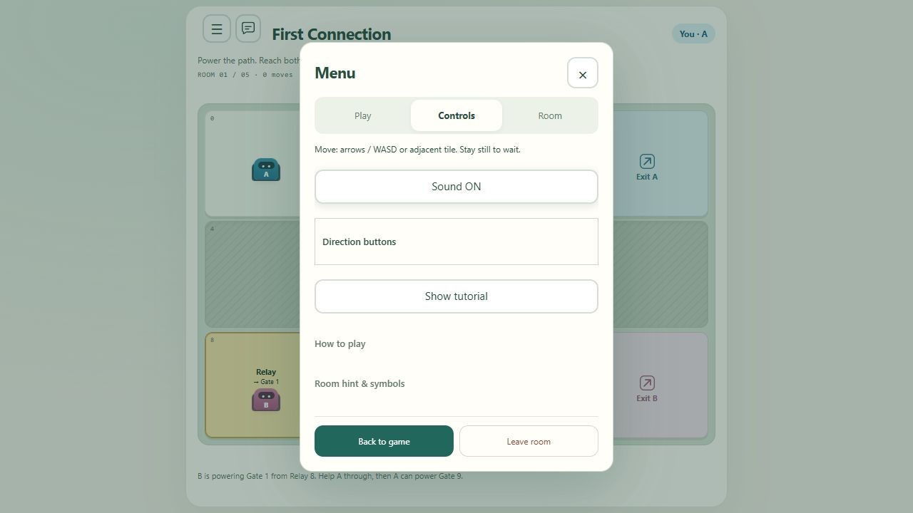

# Audio Feedback

## Behavior

Short original Web Audio effects accompany robot movement, crate transport, parking, gate opening/closing, completion and newly received teammate signals. Existing movement animations and gate flashes remain the visual feedback. Sound does not change game rules or require downloads, microphone access or background music.

Menu → Controls exposes Sound ON/OFF. The browser stores the preference when local storage is available. Playback requires a trusted first interaction and a running audio context; hidden pages stay silent. Audio initialization and device failures must not interrupt gameplay.

State transitions produce one prioritized cue: completion, crate parking/transport, gate change, then movement. This keeps simultaneous changes from producing a noisy stack. Initial snapshots, new missions, duplicate states and blocked moves are silent. Incoming teammate signals use their existing identity to avoid duplicate notifications; initial communication snapshots are silent.

## Verification

All 87 automated tests passed, including three sound transition tests and HTTP delivery of the new JavaScript module. The container smoke asset list now includes that module, but no container build or smoke run was performed.

Browser verification used a disposable local room with a scripted partner. Sound OFF persisted after reload, switching back restored Sound ON, and an arrow-key move advanced Robot A to Gate 1. No browser console errors were captured and the game had no page overflow at the current desktop viewport. These checks validate state and integration; actual speaker volume, sound quality and phone playback still need listening on user devices.

Source-only update under the 1.1.0 development line. No Docker image or Azure deployment is included.
