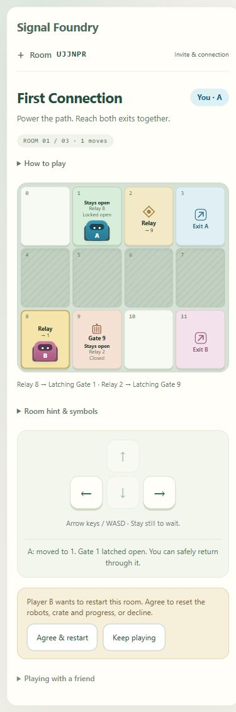

# Current-room restart

Implemented and verified: October 8, 2026.

## Player flow

During any of the three active Signal Foundry rooms, the panel below movement controls offers **Request restart**. The other player can choose **Agree & restart** or **Keep playing**. The requester can choose **Cancel request**. Players can continue moving while consent is pending.

Matching consent from two different live players resets only the current authored room. The room code and campaign position remain; robots, crate, pings, gate latches and move count return to their initial state. A new mission ID also resets the client Pull selection. After completion, the existing mutual Practice again / Next room controls apply instead.

## Authority and stale-message handling

The server owns `restart: { revision, requestedBy }`. Restart and cancel commands contain the current mission ID and restart revision, alongside the existing authenticated command envelope. Opening or clearing a request advances its revision. Repeating one's own request cannot reset the room.

Cancellation, partner decline, disconnect/pause and terminal completion invalidate prior consent. A request with an outdated revision returns `STALE_RESTART`; an old mission ID is rejected. Cached duplicate commands retain their original acknowledgment and never reapply a reset or restore a canceled request. Recovery requires fresh consent from both players. This flow applies to independent Foundry movement, not legacy comparison profiles.

## Verification

- Pinned TypeScript build and full automated suite: 71 tests passed, zero failures.
- Four new authority tests cover all three room resets, full crate/gate/ping/count reset, distinct-player consent, movement during a request, cancellation/decline, stale requests, duplicate delivery, disconnect/reconnect and terminal invalidation.
- The real two-cookie WebSocket crate test checks cancellation, partner acceptance, duplicate reset delivery and continued completion/progression.
- Browser A with the development wire partner verified B's request, A's Agree & restart, A's request and cancellation, B's acceptance of a fresh request, and successful movement after reset. First Connection retained its title/code, returned A to 0/B to 8 and displayed zero moves.
- At an emulated 390-by-844 viewport, document client/scroll widths were both 375 and restart buttons were 44 pixels high. The viewport was restored and the disposable test room closed.

`game/tests/manual-partner.mjs ROOM_CODE restart-review` is an optional development-only inspection sequence. It is not served or started by the public game. This evidence does not establish independent human acceptance, actual phone/touch operation or public network reliability.

## Next bounded cycle

Observe a first-time human pair completing the three rooms without coaching. Record whether the crate dock, Pull toggle, restart consent and gate rules are understood. Prioritize fixes to observed confusion before adding more levels. Actual phone controls and Azure/public deployment prerequisites remain open.
