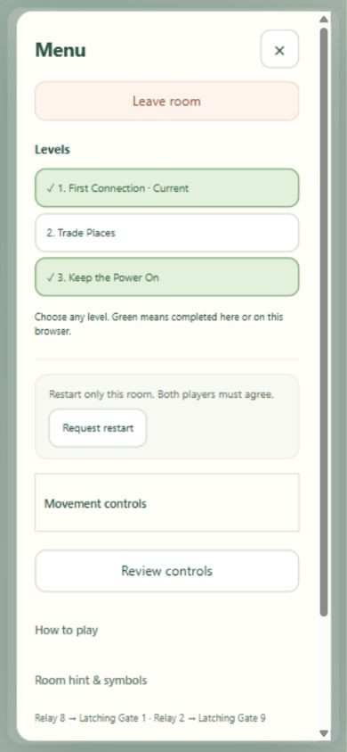
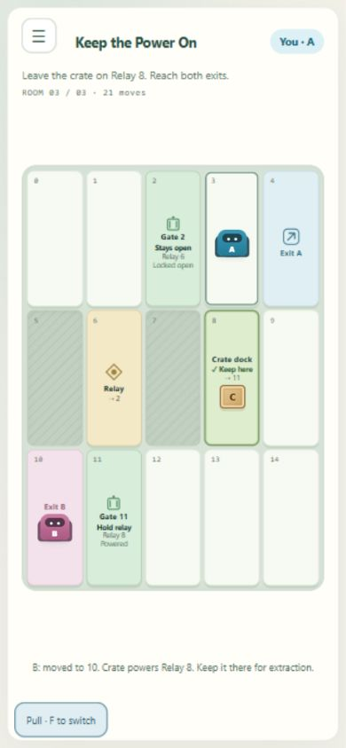

# Level selection, progress and quick crate controls

Implemented: October 8, 2026. Applies to the three-room Signal Foundry adventure.

## Player experience

- **Leave room** is directly below the Menu heading, outside collapsed room information. It needs no partner approval and uses the existing room-end behavior during a mission. The heading and exit area stay available while menu contents scroll.
- **Levels** lists every authored room, including unfinished rooms. Either player may request a room during play or after completion. The partner can accept the same room or decline. Selecting the current room is a replay request. Switching resets the chosen room, retains the room code and preserves completion history.
- Completed levels display a green background and a checkmark, plus accessible completed text. Completion is recorded by the server only after actual joint success. The browser remembers witnessed completion across refresh/new rooms using versioned local storage. This is local progress, not an account achievement or submitted score; separate browsers can have different historical records.
- Walk into a crate to **push** automatically. Press **F** to toggle Move / Push and Pull, then use normal movement keys or adjacent tile taps. A mode button on the play surface supports the same toggle for touch/click users. Neither action requires opening Menu. Held-key repeats do not repeatedly toggle the mode. The button displays the current mode, and a new mission resets to Move / Push.
- Crate help is updated and versioned so existing users receive the shortcut explanation once. Help remains reviewable in Menu.

## Authority and recovery

The room projects a campaign catalog, completed stages and a revision-bound selection request. `selectLevel` carries mission ID, stage and level revision; `cancelLevel` carries mission ID and level revision. Only a canonical authored level in the current campaign can be chosen. Two distinct live players must agree on the same request. Replacement, decline, disconnect, completion, restart or terminal progression invalidate conflicting consent. Duplicate accepted commands do not switch again; old mission/revision requests reject.

Movement may continue while a level choice is pending. Exit does not wait for gameplay consent. If a movement command is awaiting acknowledgment, the client queues Leave immediately afterward. If disconnected, Leave is requested for the next authorized connection; an offline browser cannot immediately release a server-owned seat. A replaced controller must reconnect/take control through the existing recovery controls. Errors stop repeated exit attempts rather than creating a retry loop.

## Verification

Pinned build and full suite: **74 tests passed**. Three new authority checks cover distinct-player consent, all authored destinations, reset/progression, stale/duplicate requests, cancel/replacement/reconnect, restart conflict, real completion history, immutable projections and exit during selection. The real two-cookie crate WebSocket test also verifies selection consent and matching campaign snapshots.

Browser A with scripted B completed the first room in six moves, inspected its green marker, selected the third room directly and completed it in 22 team moves. F toggled Pull twice and both pulls moved the crate into its dock; clicking the play-surface button returned to Move without Menu. Both completed rooms were green, while the skipped second room remained unfinished. An active third-room replay exited directly through Menu and returned to the entry page.

Emulated 320-by-568 and 844-by-390 crate layouts had matching document/viewport dimensions, no page scrolling and no tile content overflow. The mode button stayed inside the viewport. These checks use browser emulation and a development-only scripted partner; independent human, physical phone and public-network acceptance remain open.

Final browser check after restarting the latest build: a new room retained the browser's green first/third-room markers while the skipped second room remained unfinished. Expanded help scrolled 160.8 pixels; Close remained at y=12.8 and Leave at y=70.8, both visible. Direct Leave returned to entry. Viewport restored, disposable helper/room closed and localhost server left running.

Current presentation: [menu organization](menu-cleanup.md) replaces the earlier single-column/top-exit layout with Play/Controls/Room and a persistent exit footer. Consent, progress and shortcut behavior stay the same.
