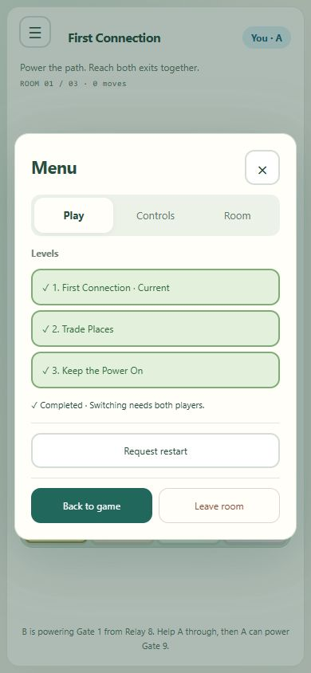

# Menu organization

Updated: October 8, 2026. This presentation update supersedes the earlier single-column menu and top exit placement.

The default **Play** section contains the three level choices, existing green completion markers and current-room restart. Routine explanatory text is shortened; request details and accept/cancel actions appear only when relevant. **Controls** contains keyboard/tile shortcuts, crate mode, optional direction buttons, tutorial replay and expandable rules/hints. **Room** contains room code, player identity, copy, connection information and optional latest-action details.

**Back to game** and **Leave room** remain in a persistent footer outside the scrolling content. Menu opens on Play every time. Pending restart/level requests add a dot to Play while another section is selected. Tabs support click, Left/Right arrows and Home/End with selected state, tab stops and labeled panels. Gameplay keyboard movement stays suppressed while Menu is open.

## Verification

Pinned TypeScript build passed. Browser A and development wire B verified keyboard tab navigation, direction-button movement within Controls, pending restart notification on Play, partner-request decline, direct selection of room three, crate controls in Controls, Room identity, Back to game, reopening on Play and direct Leave returning to entry. Stored completed markers remained visible; this inspection does not claim those historical completions occurred during this cycle.

At emulated 320-by-568 with expanded long rules, the menu body had 1,106 pixels of content in a 313-pixel area; the footer buttons remained visible at y=491..535. At 844-by-390, Leave remained at y=313..357 and Close at y=33..77. Document dimensions matched each viewport. Viewport restored, disposable room/helper closed and updated localhost server left running.

No game rules, server contracts or persistence semantics changed. The prior 74-test authority baseline remains applicable; this presentation cycle used build and browser verification rather than claiming a fresh full-suite run. Physical phone, independent human and public-network acceptance remain separate work.
