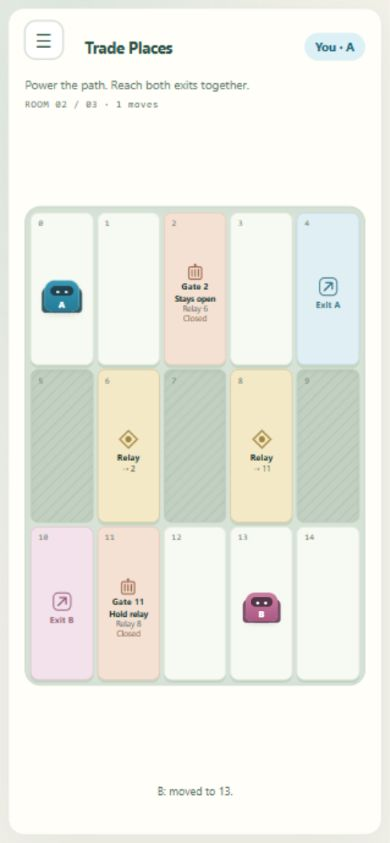

# Single-screen gameplay requirements and implementation

Updated: October 8, 2026. Scope: the three active Signal Foundry rooms. Entry and waiting-room screens retain their existing flow.

## Refined user need

Keep attention on cooperation and the factory map. The active play surface should fit the viewport without page scrolling; tools and repeated explanations should be available on demand. Simplification must preserve touch, keyboard, recovery, accessible names and critical feedback.

## Requirements and acceptance

| ID | Requirement | Acceptance |
| --- | --- | --- |
| UX-01 | One viewport for active play | Room title/identity, short objective, progress, full map and concise feedback fit tested portrait and landscape sizes without document overflow. |
| UX-02 | Upper-left Menu | Restart consent, cancel/decline, room code/copy, connection information, Leave, controls, Pull and detailed help are available in one accessible dialog. Close button and Escape work. Long expanded help may scroll inside the dialog, never the play surface. |
| UX-03 | Sustainable movement after hiding arrows | Arrow keys / WASD remain supported. Tapping an adjacent walkable tile moves toward it; tapping a distant walkable tile publishes a ping. Direction buttons remain available inside Menu. |
| UX-04 | Teaching arrows are temporary | Only the initial First Connection shows direction buttons on the play surface; they can be hidden early through Menu. Entering a later room or explicitly hiding them saves that preference per browser, so refresh and future runs keep them in Menu. |
| UX-05 | First-encounter tutorials | Show movement help on the first independent-play encounter and crate help on the first crate-room encounter. Got it records acknowledgment per browser with versioned local storage; unavailable storage falls back to the current page session. Restart and refresh do not repeat acknowledged tutorials. Review controls reopens the relevant lesson. Acknowledgment is not proof of mastery. |
| UX-06 | Simple crate interaction | Walking into a crate pushes automatically. Pull is explicitly selected in Menu. An active Pull chip stays visible and can return directly to Move. The crate dock marker and room objective remain visible. |
| UX-07 | Critical events remain discoverable | A pending restart has a visible notification linking to Menu. Paused/offline/recovery status remains visible. Success shows the existing Next / Practice choices over the map. Ordinary status/explanations do not add page height. Full latest movement feedback is also available in Menu. |
| UX-08 | Preserve game authority | No server rule, consent, transport, crate recovery or campaign progression changes. Tile movement uses existing authoritative move commands and blocked-move feedback. |

## Interaction decisions

Tutorials are local overlays: the partner can continue moving. Opening Menu does not pause the shared room. Keyboard movement is suppressed while a local dialog is open, preventing accidental moves while reviewing help. Touch players can use adjacent tiles continuously, or expand Menu's Movement controls. Learned help is recoverable, rather than removed permanently.

The implementation retains English UI/documentation. Existing legacy comparison profiles retain their layout and rules. Adjacent tiles now advertise Move/Pull in their accessible names; other tiles advertise Point out.

## Verification

The pinned build and full 71-test suite pass. Browser A with scripted wire B completed First Connection in six moves and Trade Places in sixteen using adjacent tile taps, then entered the crate room. First movement and first crate lessons appeared; the second room did not repeat the movement lesson. Menu exposes restart and crate controls; selecting Pull creates the visible mode chip, and the chip returns to Move. Request restart remains discoverable after closing Menu and can be canceled from the notification.

At emulated 390-by-844, 320-by-568 and 844-by-390 sizes, document dimensions equal viewport dimensions without page scrolling. The smaller crate layouts had no tile content overflow. First-room teaching arrows remain visible; second/third-room arrows are in Menu. Success controls remain reachable without scrolling the page. Final accessibility/focus refinement avoids reparenting focused menu controls on every snapshot and aligns tile accessible names with their new actions.

These are local browser and scripted-partner checks, not independent human, actual phone/touch, public-network or exhaustive device coverage. Tiny viewports, high text zoom and long help use bounded overlay scrolling; universal zero scrolling for every accessibility setting is not promised. Observe first-time players next, especially whether adjacent tapping versus distant pings is understood and whether acknowledged lessons need stronger practice-based completion.

Final persistence inspection: explicitly hiding First Connection teaching arrows, reloading and reconnecting retained the arrows in Menu with no tutorial popup. Review controls reopened the movement lesson. The disposable final room was closed, viewport restored and latest compiled localhost server left running.

Current follow-up: [level selection and crate shortcuts](level-selection-and-crate-controls.md) adds direct sticky Menu exit, mutual level choice, green browser/room completion records and F/play-surface mode switching. This supersedes UX-06's Menu-only Pull access and the earlier single-purpose active Pull chip.
